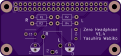

# PCB source files I made with KiCAD.

I've been working on Raspberry Pi Zero stuff mainly. I'm a super newbie in terms of electronic circuit and PCB design, but I've placed them here in this repo just in case someone finds them useful.

## Raspberry Pi Zero stuff

### zeroaudio1

A pHAT-like add-on board that adds a headphone jack to your Raspberry Pi Zero.
This PCB uses a PWM audio circuit remixed from [PiZero PWM audio by Adafruit](https://learn.adafruit.com/adding-basic-audio-ouput-to-raspberry-pi-zero/pi-zero-pwm-audio) that is licensed under [CC BY-SA 3.0](http://creativecommons.org/licenses/by-sa/3.0/).

### zerocontrol1

A pHAT-like add-on board that adds a cursor key (via GPIO) and a [0.96" I2C OLED](https://www.amazon.com/Diymall-Yellow-Serial-Arduino-Display/dp/B00O2LLT30/ref=sr_1_1?ie=UTF8&qid=1482212267&sr=8-1&keywords=diymall+oled) to your Raspberry Pi Zero.

### zerocontrol2

A pHAT-like add-on board that adds a game pad (via GPIO) your Raspberry Pi Zero.

### zerocontrol3

A pHAT-like add-on board that adds a game pad (via GPIO) that is designed to be used together with [Adafruit PiTFT 2.2](https://www.adafruit.com/products/2315).

### zeroui1

A pHAT-like add-on board that adds a headphone jack, [0.96" I2C OLED](https://www.amazon.com/Diymall-Yellow-Serial-Arduino-Display/dp/B00O2LLT30/ref=sr_1_1?ie=UTF8&qid=1482212267&sr=8-1&keywords=diymall+oled), and a 7-button cursor key (via GPIO) to your Raspberry Pi Zero.

This PCB uses a PWM audio circuit remixed from [PiZero PWM audio by Adafruit](https://learn.adafruit.com/adding-basic-audio-ouput-to-raspberry-pi-zero/pi-zero-pwm-audio) that is licensed under [CC BY-SA 3.0](http://creativecommons.org/licenses/by-sa/3.0/).

# KiCADで作成しているPCBのソース。

現在は Raspberry Pi Zero 関連が主たるターゲットになっています。電子回路もPCB設計も超ど素人ですが、何かの参考になれば。

## Raspberry Pi Zero 関連

### zeroaudio1

Raspberry Pi Zero にヘッドフォン端子をつけるための pHAT のようなボードです。

このPCBの回路は [PWM オーディオ出力回路 by Adafruit](https://learn.adafruit.com/adding-basic-audio-ouput-to-raspberry-pi-zero/pi-zero-pwm-audio) から [CC BY-SA 3.0](http://creativecommons.org/licenses/by-sa/3.0/) に基づいてリミックスされた回路を使用しています。

### zerocontrol1

Raspberry Pi Zero にカーソルキーと [0.96" I2C OLED](https://www.amazon.com/Diymall-Yellow-Serial-Arduino-Display/dp/B00O2LLT30/ref=sr_1_1?ie=UTF8&qid=1482212267&sr=8-1&keywords=diymall+oled) をつけるための pHAT のようなボードです。

### zerocontrol2

Raspberry Pi Zero にゲームパッドをつけるための pHAT のようなボードです。

### zerocontrol3

Raspberry Pi Zero にゲームパッド（上下さかさま）をつけるための pHAT のようなボードです。
[Adafruit PiTFT 2.2](https://www.adafruit.com/products/2315) と組み合わせることが前提の設計ですが、他にも使えるかもしれません。

### zeroui1

Raspberry Pi Zero にヘッドフォン端子と、[0.96" I2C OLED](https://www.amazon.com/Diymall-Yellow-Serial-Arduino-Display/dp/B00O2LLT30/ref=sr_1_1?ie=UTF8&qid=1482212267&sr=8-1&keywords=diymall+oled) と、7ボタンのカーソルキーをつけるための pHAT のようなボードです。

このPCBの回路は [PWM オーディオ出力回路 by Adafruit](https://learn.adafruit.com/adding-basic-audio-ouput-to-raspberry-pi-zero/pi-zero-pwm-audio) から [CC BY-SA 3.0](http://creativecommons.org/licenses/by-sa/3.0/) に基づいてリミックスされた回路を使用しています。

