# KiCAD projects for Raspberry Pi

I've been working on Raspberry Pi Zero stuff mainly. I'm a super
newbie in terms of electronic circuit and PCB design, but I've placed
them here in this repo just in case someone finds them useful.

By uploading *.kicad_pcb file to [OSH Park](oshpark.com), anyone can
get the exact same PCB.  Add-on boards for Raspberry Pi Zero would
cost $15/3 boards or so, and ones for Raspberry Pi would cost $29/3
boards or so.

# ラズパイ向けPCBのKiCADソース

現在は Raspberry Pi Zero 関連が主たるターゲットになっています。電子回路
もPCB設計も超ど素人ですが、何かの参考になれば。

はんだ付け初心者のためスルーホール/DIPが基本になっていますが I2Sになる
とそうも言ってられず表面実装はじめました。

[OSH Park](oshpark.com) に *.kicad_pcbファイルをアップロードすれば、誰
でも下記のPCB基板を手に入れることができます。Raspberry Pi Zero 用で
$15/3枚、Raspberry Pi用で$29/3枚ほどです。

# Raspberry Pi Zero stuff / Raspberry Pi Zero 関連

## zeroaudio1 (RPi Zero PWM Audio 1)

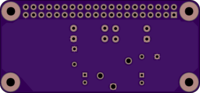

A pHAT-like add-on board that adds a headphone jack to your Raspberry
Pi Zero.  This PCB uses a PWM audio circuit remixed from [PiZero PWM
audio by
Adafruit](https://learn.adafruit.com/adding-basic-audio-ouput-to-raspberry-pi-zero/pi-zero-pwm-audio)
that is licensed under [CC BY-SA
3.0](http://creativecommons.org/licenses/by-sa/3.0/).

NOTE: Noise is pretty loud, like AM radio.

Raspberry Pi Zero にヘッドフォン端子をつけるための pHAT のようなボード
です。

このPCBの回路は [PWM オーディオ出力回路 by
Adafruit](https://learn.adafruit.com/adding-basic-audio-ouput-to-raspberry-pi-zero/pi-zero-pwm-audio)
から [CC BY-SA 3.0](http://creativecommons.org/licenses/by-sa/3.0/) に
基づいてリミックスされた回路を使用しています。

NOTE: 音声にけっこうノイズが乗ります。AMラジオくらい。

##### BOM / 主な部品
  - [SJ1-3513N](https://www.digikey.com/product-detail/en/cui-inc/SJ1-3513N/CP1-3513N-ND/738686)
  - [Tactical Switch](https://www.digikey.com/product-detail/en/te-connectivity-alcoswitch-switches/1825910-6/450-1650-ND/1632536)

## zerocontrol1 (RPi Zero Controller Type 1)

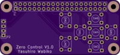
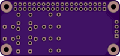

A pHAT-like add-on board that adds a cursor key (via GPIO) and a
[0.96" I2C
OLED](https://www.amazon.com/Diymall-Yellow-Serial-Arduino-Display/dp/B00O2LLT30/ref=sr_1_1?ie=UTF8&qid=1482212267&sr=8-1&keywords=diymall+oled)
to your Raspberry Pi Zero.

Raspberry Pi Zero にカーソルキーと [0.96" I2C
OLED](https://www.amazon.com/Diymall-Yellow-Serial-Arduino-Display/dp/B00O2LLT30/ref=sr_1_1?ie=UTF8&qid=1482212267&sr=8-1&keywords=diymall+oled)
をつけるための pHAT のようなボードです。

##### BOM / 主な部品
  - [0.96" I2C OLED](https://www.amazon.com/Diymall-Yellow-Serial-Arduino-Display/dp/B00O2LLT30/ref=sr_1_1?ie=UTF8&qid=1482212267&sr=8-1&keywords=diymall+oled) 
  - [Tactical Switch](https://www.digikey.com/product-detail/en/te-connectivity-alcoswitch-switches/1825910-6/450-1650-ND/1632536)

## zerocontrol2 (RPi Zero Controller Type 2 - Gamepad)

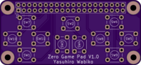
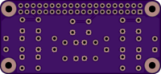

A pHAT-like add-on board that adds a game pad (via GPIO) your
Raspberry Pi Zero.

Raspberry Pi Zero にゲームパッドをつけるための pHAT のようなボードです。

##### BOM / 主な部品
  - [Tactical Switch](https://www.digikey.com/product-detail/en/te-connectivity-alcoswitch-switches/1825910-6/450-1650-ND/1632536)

## zerocontrol3 (RPi Zero Controller Type 3 - Gamepad Reversed)

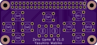

A pHAT-like add-on board that adds a game pad (via GPIO) that is
designed to be used together with [Adafruit PiTFT
2.2](https://www.adafruit.com/products/2315). Please note that the
game pad is laid out up-side-down by design.

UPDATE: Moved GPIO pins to avoid I2S-related pins (12, 35, 40). Moved
GND pins to GNDD pins used in zeroamp1 circuit. Changed footprint of
momentary switches to Panasonic EVQ11.

Raspberry Pi Zero にゲームパッド（上下さかさま）をつけるための pHAT の
ようなボードです。[Adafruit PiTFT
2.2](https://www.adafruit.com/products/2315) と組み合わせることが前提の
設計ですが、他にも使えるかもしれません。

UPDATE: I2Sで必要なピン(12,35,40)を使わないように修正。また、I2Sボード
と共通のGNDD（デジタル用GND）ピンを使うように修正。モメンタリースイッチ
のフットプリントを巷によくある6mm角4ピンから [Panasonic EVQ11互
換](http://akizukidenshi.com/catalog/g/gP-08080/) に変更。

##### BOM / 主な部品
  - [Panasonic EVQ11](https://www.digikey.com/product-detail/en/panasonic-electronic-components/EVQ-11U04M/P8082STB-ND/259535)

## zerocontrol4 (RPi Zero Controller Type 4)

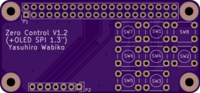
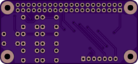

A pHAT-like add-on board that adds a cursor key (via GPIO) and a [1.3"
SPI
OLED](https://www.amazon.com/LANMU-SSH1106-128X64-Display-Arduino/dp/B01G596QWU/ref=sr_1_1?ie=UTF8&qid=1486331859&sr=8-1&keywords=1.3%22+SPI+OLED)
to your Raspberry Pi Zero.

Raspberry Pi Zero にカーソルキーと [1.3" SPI
OLED](https://www.amazon.com/LANMU-SSH1106-128X64-Display-Arduino/dp/B01G596QWU/ref=sr_1_1?ie=UTF8&qid=1486331859&sr=8-1&keywords=1.3%22+SPI+OLED)
をつけるための pHAT のようなボードです。

UPDATE: I2Sで必要なピン(12,35,40)を使わないように修正。また、I2Sボード
と共通のGNDD（デジタル用GND）ピンを使うように修正。

##### BOM / 主な部品
  - [1.3" SPI OLED](https://www.amazon.com/LANMU-SSH1106-128X64-Display-Arduino/dp/B01G596QWU/ref=sr_1_1?ie=UTF8&qid=1486331859&sr=8-1&keywords=1.3%22+SPI+OLED)
  - [Tactical Switch](https://www.digikey.com/product-detail/en/te-connectivity-alcoswitch-switches/1825910-6/450-1650-ND/1632536)

## zeroui1  (RPi Zero UI Type 1)

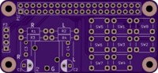
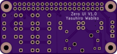

A pHAT-like add-on board that adds a headphone jack, [0.96" I2C
OLED](https://www.amazon.com/Diymall-Yellow-Serial-Arduino-Display/dp/B00O2LLT30/ref=sr_1_1?ie=UTF8&qid=1482212267&sr=8-1&keywords=diymall+oled),
and a 7-button cursor key (via GPIO) to your Raspberry Pi Zero.

This PCB uses a PWM audio circuit remixed from [PiZero PWM audio by
Adafruit](https://learn.adafruit.com/adding-basic-audio-ouput-to-raspberry-pi-zero/pi-zero-pwm-audio)
that is licensed under [CC BY-SA
3.0](http://creativecommons.org/licenses/by-sa/3.0/).

UPDATE: During something is shown on the OLED, terrible noise appears
on the audio output, like an AM radio that is not tuned in.

Raspberry Pi Zero にヘッドフォン端子と、[0.96" I2C
OLED](https://www.amazon.com/Diymall-Yellow-Serial-Arduino-Display/dp/B00O2LLT30/ref=sr_1_1?ie=UTF8&qid=1482212267&sr=8-1&keywords=diymall+oled)
と、7ボタンのカーソルキーをつけるための pHAT のようなボードです。

このPCBの回路は [PWM オーディオ出力回路 by
Adafruit](https://learn.adafruit.com/adding-basic-audio-ouput-to-raspberry-pi-zero/pi-zero-pwm-audio)
から [CC BY-SA 3.0](http://creativecommons.org/licenses/by-sa/3.0/) に
基づいてリミックスされた回路を使用しています。

UPDATE: OLEDに何か表示させているとそのノイズがひどいです。チューニングが合っていないAMラジオくらい。

##### BOM / 主な部品
  - [SJ1-3513N](https://www.digikey.com/product-detail/en/cui-inc/SJ1-3513N/CP1-3513N-ND/738686)
  - [0.96" I2C OLED](https://www.amazon.com/Diymall-Yellow-Serial-Arduino-Display/dp/B00O2LLT30/ref=sr_1_1?ie=UTF8&qid=1482212267&sr=8-1&keywords=diymall+oled) 
  - [Tactical Switch](https://www.digikey.com/product-detail/en/te-connectivity-alcoswitch-switches/1825910-6/450-1650-ND/1632536)

## zeroamp1 (RPi Zero DAC as Headphone Amplifier)

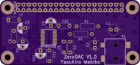
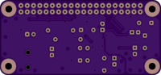

</a>

A pHAT-like add-on board that adds I2S DAC PCM5102A. This was first
expected to work as an headphone amplifier (HPA) but then turned out
you cannot use it that way:) PCM5102's output pin is only line level,
but it just worked when I plugged an earphone/headphone with [a
breakout board out
there](https://www.amazon.com/Industry-Park-PCM5102-Decoder-Raspberry/dp/B01LYLEKVW/ref=sr_1_2?ie=UTF8&qid=1486141456&sr=8-2&keywords=i2s+dac).

UPDATE: USE WITH CAUTION as a headphone amplifier. According to
PCM5102A datasheet, the output minimum impedance is 1kR and the
effective voltage is 2.1V, therefore the maximum effective current is
2.1mA. This circuitary inserts 1kR register there to limit the current
to this maximum value. This is tested with an earphone that came with
iPhone and it works fine, but please try at your own risk.

Raspberry Pi Zero に I2S DAC である PCM5102A を搭載して無理やりヘッドフォ
ンアンプとして使ってみようという pHAT のようなボードです。PCM5102Aの出
力はラインレベルですが、[巷のブレイクアウ
ト
](https://www.amazon.com/Industry-Park-PCM5102-Decoder-Raspberry/dp/B01LYLEKVW/ref=sr_1_2?ie=UTF8&qid=1486141456&sr=8-2&keywords=i2s+dac)
にイヤフォンやヘッドフォンをつないだら意外に聴けたので。

アナログ回路が最小限のためか、iPhone付属イヤフォンではノイズが感じられ
ず、高音質です。（piamp2よりも音がいいです）。

UPDATE: PCM5102Aで直接ヘッドフォンを駆動するのはもともと厳しいため、使
用の際は注意が必要です。データシートによると出力側の最小インピーダンス
1kRと実効電圧2.1V から引き出せる実効電流が最大 2.1mAとなります。この回
路では 1kRの抵抗を入れることによって電流をこの最大値ぎりぎりに制限して
います。実験した範囲ではiPhone付属イヤフォンで使えていますが、くれぐれ
も自己責任でお願いします。

##### BOM / 主な部品
  - [PCM5102A](http://www.digikey.com/product-detail/en/texas-instruments/PCM5102APWR/296-36707-1-ND/4341334)
  - [SJ1-3513-SMT-TR](https://www.digikey.com/product-detail/en/cui-inc/SJ1-3513-SMT-TR/CP1-3513SJCT-ND/659929)

# Raspberry Pi stuff / Raspberry Pi 関連

## piamp2 (RPi DAC + Headphone Amplifier)

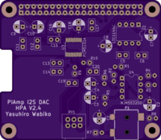
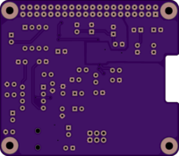

</a>

A HAT-like add-on board that adds I2S DAC PCM5102A, OPAmp NJM5532D and
a headphone output jack to Raspberry Pi 3. This should work as an
headphone amplifier (HPA) more natually than zeroamp1 thanks to
NJM5532D. 

This is not a high quality board. Every time Pi tries to show a
character over SSH for example, a small noise comes in, meaning there
seems (lots of) issues in terms of analog circuit design.

UPDATE: Fixed a bug in potentionmeter pins.

Raspberry Pi3 に I2S DAC である PCM5102A とOPアンプ NJM5532D を搭載して
ヘッドフォンアンプとして使ってみようという pHAT のようなボードです。ア
ナログ回路的な問題が多々あるようで、Raspberry Piがsshターミナル越しにテ
キストを出力した時などにヘッドフォン出力に多少ノイズが入ります。

UPDATE: ポテンションメータのピン接続が間違っていたので直しました。

##### BOM / 主な部品
  - [PCM5102A](http://www.digikey.com/product-detail/en/texas-instruments/PCM5102APWR/296-36707-1-ND/4341334)
  - [NJM5532D](http://www.digikey.com/product-detail/en/njr-corporation-njrc/NJM5532D/NJM5532D-ND/805752)
  - [LTC1144C](https://www.digikey.com/product-detail/en/linear-technology/LTC1144CN8-PBF/LTC1144CN8-PBF-ND/891681)
  - [SJ1-3513-SMT-TR](https://www.digikey.com/product-detail/en/cui-inc/SJ1-3513-SMT-TR/CP1-3513SJCT-ND/659929)

## smt1 (SMT soldering practice for PCM5102A)

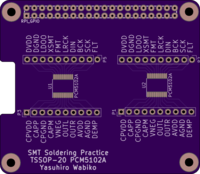
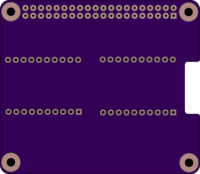

SMT soldering practice board featuring PCM5102A (TSSOP-20) that happens to be a breakout board as well.

TSSOP-20 パッケージである PCM5102A を使って表面実装のはんだ付けを練習するための基板です。結果的にブレイクアウトとしての機能も兼ねています。

# Acknowledgments / 謝辞

  - Electronic circuit / 電子回路全般 : [Adafruit](www.adafruit.com)
  - PCB fabrication service / PCB生産委託 : [OSH Park](oshpark.com)
  - CAD software / CAD ソフト : [KiCAD](http://kicad-pcb.org/)

# Disclaimer / 免責事項

Contents posted in this site is for informational purpose only and nothing is guaranteed. Headphone amplifier is especially dangerous as it can cause permanent damage to your ears.
すべて無保証です。特にヘッドフォンアンプ基板は大変危険です。鼓膜を損傷するかもしれません。くれぐれも自己責任でお願いいたします。

