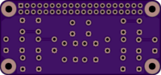
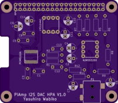
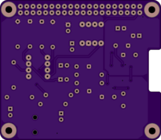

# PCB source files I made with KiCAD.

I've been working on Raspberry Pi Zero stuff mainly. I'm a super newbie in terms of electronic circuit and PCB design, but I've placed them here in this repo just in case someone finds them useful.

By uploading *.kicad_pcb file to [OSH Park](oshpark.com), anyone can get the exact same PCB.
Add-on boards for Raspberry Pi Zero would cost $15/3 boards or so, and ones for Raspberry Pi would cost $29/3 boards or so.

## Raspberry Pi Zero stuff

### zeroaudio1

A pHAT-like add-on board that adds a headphone jack to your Raspberry Pi Zero.
This PCB uses a PWM audio circuit remixed from [PiZero PWM audio by Adafruit](https://learn.adafruit.com/adding-basic-audio-ouput-to-raspberry-pi-zero/pi-zero-pwm-audio) that is licensed under [CC BY-SA 3.0](http://creativecommons.org/licenses/by-sa/3.0/).

### zerocontrol1

A pHAT-like add-on board that adds a cursor key (via GPIO) and a [0.96" I2C OLED](https://www.amazon.com/Diymall-Yellow-Serial-Arduino-Display/dp/B00O2LLT30/ref=sr_1_1?ie=UTF8&qid=1482212267&sr=8-1&keywords=diymall+oled) to your Raspberry Pi Zero.

### zerocontrol2

A pHAT-like add-on board that adds a game pad (via GPIO) your Raspberry Pi Zero.

### zerocontrol3

A pHAT-like add-on board that adds a game pad (via GPIO) that is designed to be used together with [Adafruit PiTFT 2.2](https://www.adafruit.com/products/2315). Please note that the game pad is laid out up-side-down by design.

UPDATE: Moved GPIO pins to avoid I2S-related pins (12, 35, 40). Moved GND pins to GNDD pins used in zeroamp1 circuit. Changed footprint of momentary switches to Panasonic EVQ11.

### zeroui1

A pHAT-like add-on board that adds a headphone jack, [0.96" I2C OLED](https://www.amazon.com/Diymall-Yellow-Serial-Arduino-Display/dp/B00O2LLT30/ref=sr_1_1?ie=UTF8&qid=1482212267&sr=8-1&keywords=diymall+oled), and a 7-button cursor key (via GPIO) to your Raspberry Pi Zero.

This PCB uses a PWM audio circuit remixed from [PiZero PWM audio by Adafruit](https://learn.adafruit.com/adding-basic-audio-ouput-to-raspberry-pi-zero/pi-zero-pwm-audio) that is licensed under [CC BY-SA 3.0](http://creativecommons.org/licenses/by-sa/3.0/).

### zeroamp1

A pHAT-like add-on board that adds I2S DAC PCM5102A that should be able to work as an headphone amplifier (HPA).

### piamp1

A HAT-like add-on board that adds I2S DAC PCM5102A and OP amp NJM5532D to Raspberry Pi 3. This should work as an headphone amplifier (HPA) more natually than zeroamp1 thanks to NJM5532D.

This PCB uses a circuit that was remixed from
[Raspberry Pi B+ for Sound source](http://www.single-ended.com/why-dont-use-raspberry-pi.htm).

## Acknowledgments

  - Electronic circuit [Adafruit](www.adafruit.com)
  - PCB fabrication service [OSH Park](oshpark.com)

# KiCADで作成しているPCBのソース。

現在は Raspberry Pi Zero 関連が主たるターゲットになっています。電子回路もPCB設計も超ど素人ですが、何かの参考になれば。

[OSH Park](oshpark.com) に *.kicad_pcbファイルをアップロードすれば、誰でもPCB基板を手に入れることができます。
Raspberry Pi Zero 用で $15/3枚、Raspberry Pi用で$29/3枚ほどです。

## Raspberry Pi Zero 関連

### zeroaudio1

Raspberry Pi Zero にヘッドフォン端子をつけるための pHAT のようなボードです。

このPCBの回路は [PWM オーディオ出力回路 by Adafruit](https://learn.adafruit.com/adding-basic-audio-ouput-to-raspberry-pi-zero/pi-zero-pwm-audio) から [CC BY-SA 3.0](http://creativecommons.org/licenses/by-sa/3.0/) に基づいてリミックスされた回路を使用しています。

NOTE: 音声にけっこうノイズが乗ります。AMラジオくらい。

### zerocontrol1

Raspberry Pi Zero にカーソルキーと [0.96" I2C OLED](https://www.amazon.com/Diymall-Yellow-Serial-Arduino-Display/dp/B00O2LLT30/ref=sr_1_1?ie=UTF8&qid=1482212267&sr=8-1&keywords=diymall+oled) をつけるための pHAT のようなボードです。

### zerocontrol2

Raspberry Pi Zero にゲームパッドをつけるための pHAT のようなボードです。

### zerocontrol3

Raspberry Pi Zero にゲームパッド（上下さかさま）をつけるための pHAT のようなボードです。
[Adafruit PiTFT 2.2](https://www.adafruit.com/products/2315) と組み合わせることが前提の設計ですが、他にも使えるかもしれません。

UPDATE: I2Sで必要なピン(12,35,40)を使わないように修正。また、I2Sボードと共通のGNDD（デジタル用GND）ピンを使うように修正。モメンタリースイッチのフットプリントを巷によくある6mm角4ピンから Panasonic EVQ11 に変更。

### zeroui1

Raspberry Pi Zero にヘッドフォン端子と、[0.96" I2C OLED](https://www.amazon.com/Diymall-Yellow-Serial-Arduino-Display/dp/B00O2LLT30/ref=sr_1_1?ie=UTF8&qid=1482212267&sr=8-1&keywords=diymall+oled) と、7ボタンのカーソルキーをつけるための pHAT のようなボードです。

このPCBの回路は [PWM オーディオ出力回路 by Adafruit](https://learn.adafruit.com/adding-basic-audio-ouput-to-raspberry-pi-zero/pi-zero-pwm-audio) から [CC BY-SA 3.0](http://creativecommons.org/licenses/by-sa/3.0/) に基づいてリミックスされた回路を使用しています。

UPDATE: OLEDに何か表示させているとそのノイズがひどいです。

### zeroamp1

Raspberry Pi Zero に I2S DAC である PCM5102A を搭載して無理やりヘッドフォンアンプとして使ってみようという pHAT のようなボードです。

### piamp1

Raspberry Pi3 に I2S DAC である PCM5102A とOPアンプ NJM5532D を搭載してヘッドフォンアンプとして使ってみようという pHAT のようなボードです。

このPCBの回路は
[Raspberry Pi B+ for Sound source](http://www.single-ended.com/why-dont-use-raspberry-pi.htm)
に掲載されている回路を参考にしています。

## 謝辞

  - 電子回路全般 [Adafruit](www.adafruit.com)
  - PCB生産委託 [OSH Park](oshpark.com)
